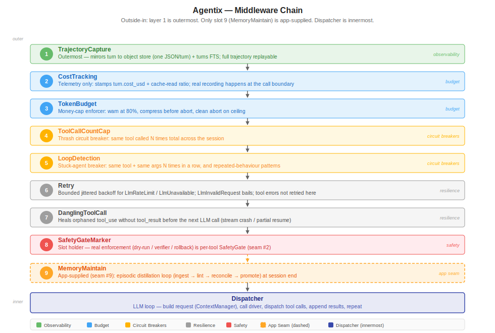

# Engine & dispatch

**Status:** living doc · **Scope:** Agentix kernel `[K]` (app-agnostic)

**Single source of truth for the turn engine and the middleware chain in `docs/`.**
Everything here is **landed** (code: `src/agentix/core/engine.py`,
`core/middleware/`, `core/agent_dispatcher.py`). Neighbouring SSoTs are referenced,
never restated: per-tool-call dispatch flow is [`tools.md`](tools.md) §6, window
assembly is [`context.md`](context.md) §5, budget enforcement is
[`budgets.md`](budgets.md) §4, the app seams are [`seams.md`](seams.md).

---

## 1. The turn engine (`core/engine.py`)

`Engine.run_turn(session, user_message=None, deadline_seconds=None)` advances a
session by exactly one turn. It is **interface-agnostic** — CLI, worker, and HTTP
surfaces all drive this one entry point — and the innermost dispatch is a
`TurnDispatcher` protocol, so tests swap in scripted fakes without touching the
chain.

The `deadline_seconds` parameter wraps the whole chain in `asyncio.timeout`; a
`TimeoutError` calls `turn.abort(...)` and returns the aborted turn without
re-raising.

The turn contract:

- The user message (if any) appends to `session.messages`; the engine snapshots
  the pre-turn count and builds a `Turn` with a **copy** of the history.
- Turn attribution: `bind_turn` / `unbind_turn` (from `agentix.drivers.session`)
  bracket the chain call so every nested driver invocation (LLM call, vendor I/O)
  carries the current `turn_index` for log and usage attribution.
- The composed middleware chain runs; a turn still `pending` after the inner
  dispatch becomes `ok`.
- On `ok`, the dispatcher's additions to `input_messages` (assistant tool-calls +
  tool results) merge back into `session.messages` as a delta; **aborted turns are
  recorded but never extend the session history**.
- `turn_index` always advances; `aborted` → session `paused` (resumable — this is
  how a budget abort becomes an operator decision, [`budgets.md`](budgets.md) §4),
  `error` → `failed`.
- A `"latest"` checkpoint is saved unless the dispatcher already did
  (`checkpoint_saved_by_dispatcher`, [`session.md`](session.md) §3); checkpoint
  failure logs, never kills the turn.

## 2. The middleware chain (`core/middleware/base.py`)

A middleware is one layer in an ordered chain, `async (turn, next_) -> turn`. It
may inspect/mutate the Turn before forwarding, await `next_(turn)`, act on the
result, or **skip the downstream entirely**. `compose_chain` wraps outside-in:
the first entry is the outermost layer.

**The order is load-bearing** — `MIDDLEWARE_ORDER` is the single source of truth,
`validate_order` enforces it at `Engine` construction, and a unit invariant tests
it. Only a **prefix** of the named slots is accepted — no reordering, no free
appends. The app's extension point is the named `MemoryMaintain` slot; adding a
new layer means changing `MIDDLEWARE_ORDER` itself ([`seams.md`](seams.md) §9).

## 3. The nine layers, outside-in

| # | Layer | Job |
|---|---|---|
| 1 | **TrajectoryCapture** | outermost — mirrors every turn to the object store (one JSON object per turn) and the `turns` table (+FTS), so the full trajectory is replayable |
| 2 | **CostTracking** | telemetry-only: stamps `turn.cost_usd` + cache-read ratio; real recording is at the call boundary ([`budgets.md`](budgets.md) §3) |
| 3 | **TokenBudget** | the money-cap enforcer: warn at 80%, compress-before-abort, clean abort ([`budgets.md`](budgets.md) §4) |
| 4 | **ToolCallCountCap** | thrash circuit breaker: same tool **N times total** across the session |
| 5 | **LoopDetection** | stuck-agent breaker: same tool + same args **N times in a row**, or same assistant text **N times in a row** |
| 6 | **Retry** | bounded, jittered backoff — retries only provider errors classified retryable (`DriverRateLimited`/`DriverUnavailable`); `DriverInvalidRequest` bails immediately; tool failures are **not** retried here (tools own their errors, [`tools.md`](tools.md) §7) |
| 7 | **DanglingToolCall** | stream repair before dispatch: crashes/partial resume can orphan a `tool_use` without its `tool_result` — the next LLM call would 400; this layer heals the history |
| 8 | **SafetyGateMarker** | a pass-through **slot holder**: the real enforcement (dry-run, verifier, rollback) is the per-tool SafetyGate ([`tools.md`](tools.md) §5); the marker pins where safety sits in the order |
| 9 | **MemoryMaintain** | the app-supplied maintain loop ([`memory.md`](memory.md) §6) |

ToolCallCountCap and LoopDetection are deliberate complements: *total across the
session* vs *identical in a row* — two different failure shapes.

## 4. The dispatcher (`core/agent_dispatcher.py`)

Innermost, inside the whole chain: the LLM loop — build the request (window
assembly through the ContextManager, [`context.md`](context.md) §5), call the
driver ([`drivers.md`](drivers.md)), dispatch tool calls (per-call flow:
[`tools.md`](tools.md) §6), append results, repeat until no tool calls or
`max_tool_iterations`. Side effects along the way: working-memory auto-record
([`memory.md`](memory.md) §2) and the throttled checkpoint cadence
([`session.md`](session.md) §3).

**Parallel read dispatch**: when `parallel_reads=True` (the default), consecutive
tool calls that all declare `mutates_target=False` are executed concurrently via
`asyncio.TaskGroup`. Result order in the transcript always matches the original
call order. Mutating calls and unknown-tool calls run sequentially. Set
`parallel_reads=False` to revert to fully-sequential dispatch (e.g. for read tools
with hidden side effects).

**Cooperative cancellation** (seam 14): an optional `cancel_check: Callable[[], bool]`
is polled between tool iterations. A `True` return aborts the turn cleanly without
interrupting any in-flight tool I/O.

App seams on the dispatcher: `TerminationPolicy` and `DispatchGuard`
([`seams.md`](seams.md)) — policy without forking the loop.
